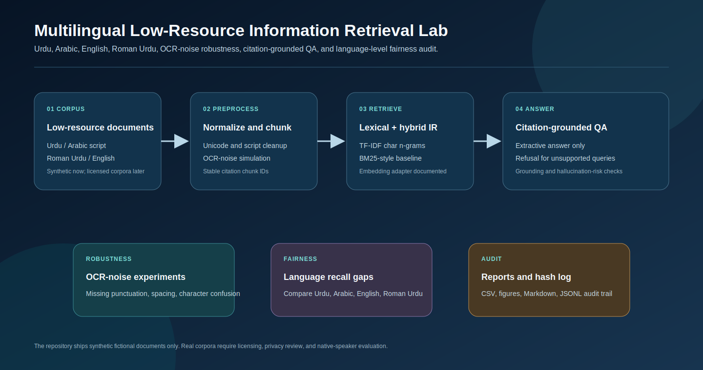
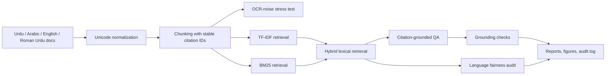
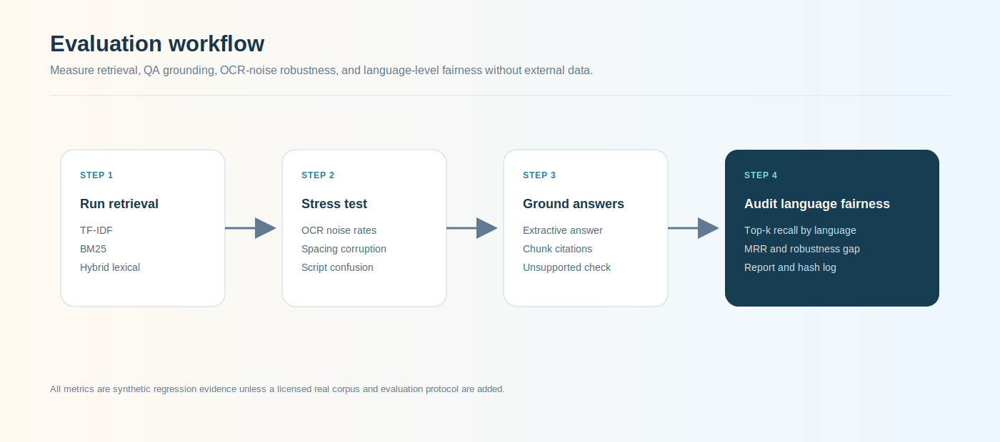

# Multilingual Low-Resource Information Retrieval Lab

<p align="center"><strong>Research-grade multilingual information retrieval and citation-grounded QA lab for Urdu, Arabic, English, Roman Urdu, and regional-language documents, with cross-lingual retrieval, OCR-noise robustness, and language fairness evaluation.</strong></p>

<p align="center">
  <a href="../../actions/workflows/python-checks.yml"></a>
  <a href="LICENSE"></a>
  
  
</p>

> **Research boundary:** this repository ships only fictional synthetic multilingual documents and queries. It does not claim production search quality, translation quality, OCR benchmark performance, or official linguistic coverage. Real corpora require licensing, privacy review, native-speaker validation, and careful sampling.

---

## Research objective

Can a multilingual retrieval and question-answering system provide accurate, citation-grounded answers for low-resource Urdu, Arabic, and regional-language documents while remaining robust to OCR noise and fair across languages and scripts?

| Research question | Evidence generated locally |
| --- | --- |
| How well do lexical baselines retrieve across scripts? | TF-IDF, BM25, and hybrid top-k metrics |
| Can cross-lingual query-document matching work offline? | English→Urdu/Arabic, Urdu→English, Roman Urdu tests |
| How much does OCR noise degrade retrieval? | Noise-rate robustness curve |
| Are answers grounded in retrieved text? | Citation coverage and unsupported-claim score |
| Are languages served unevenly? | Language-level recall and fairness-gap audit |
| Can experiments remain reproducible? | CSV results, report, figures, and hash-chained audit log |

---

## Architecture

<p align="center"></p>



The diagram is conceptual. Data-driven results are produced only after running the lab.

---

## Run today — no dataset needed

```bash
python scripts/run_synthetic_ir_lab.py
```

Windows quick start:

```bat
cd %USERPROFILE%\multilingual-low-resource-ir-lab
git pull

py -m venv .venv
.venv\Scripts\activate

python -m pip install --upgrade pip
python -m pip install -r requirements.txt
python scripts/run_synthetic_ir_lab.py
```

Optional controls:

```bash
python scripts/run_synthetic_ir_lab.py --top-k 5 --noise-rates 0,0.08,0.16 --seed 42
```

---

## Generated local outputs

```text
outputs/results/synthetic_documents.csv
outputs/results/synthetic_queries.csv
outputs/results/synthetic_chunks.csv
outputs/results/synthetic_retrieval_results.csv
outputs/results/synthetic_qa_answers.csv
outputs/results/synthetic_retrieval_metrics.csv
outputs/results/synthetic_fairness_audit.csv
outputs/results/synthetic_ir_summary.json
outputs/reports/synthetic_ir_report.md
outputs/audit/ir_audit_log.jsonl

outputs/figures/synthetic_retrieval_robustness.png
outputs/figures/synthetic_language_fairness.png
outputs/figures/synthetic_qa_status.png
outputs/figures/synthetic_citation_grounding.png
```

Every output is synthetic and generated locally.

---

## Synthetic corpus coverage

| Language | Script | Example domain | Research role |
| --- | --- | --- | --- |
| Urdu | Arabic script | health, water | Low-resource right-to-left retrieval |
| Arabic | Arabic script | education, agriculture | Cross-lingual and script normalization |
| English | Latin script | disaster, employment | Bridge language for cross-lingual queries |
| Roman Urdu | Latin script | health, education | Informal transliterated language retrieval |
| Regional placeholder | Latin script | agriculture | Adapter pattern for future local-language corpora |

The corpus is intentionally small and fictional. It validates pipeline behavior, not language coverage.

---

## Retrieval methods

| Method | Description | Why it matters |
| --- | --- | --- |
| `tfidf_char_xlingual` | Character n-gram TF-IDF with transparent query expansion | Handles mixed scripts and OCR-like variation better than word-only baselines |
| `bm25_xlingual` | Offline BM25-style lexical baseline | Strong classic IR comparison point |
| `hybrid_lexical_xlingual` | Weighted TF-IDF + BM25 combination | Tests whether complementary lexical evidence improves ranking |
| Embedding adapter | Future multilingual embedding interface | No embedding result is claimed until a model, license, and run log exist |

The query-expansion bridge is a small auditable baseline. It is not machine translation.

---

## Evaluation workflow

<p align="center"></p>

| Metric | Meaning | Boundary |
| --- | --- | --- |
| Top-1 accuracy | Expected document appears at rank 1 | Synthetic labels only |
| Top-3 accuracy | Expected document appears in top 3 | Synthetic labels only |
| MRR | Mean reciprocal rank of expected document | Synthetic labels only |
| Citation coverage | Answer includes chunk citations | Grounding heuristic |
| Unsupported-claim score | Lexical estimate of answer text unsupported by retrieved chunks | Conservative heuristic |
| OCR robustness | Metric degradation across noise levels | Simulated OCR noise only |
| Language fairness gap | Difference in top-k recall across expected document languages | Synthetic audit signal |

---

## Citation-grounded QA

The QA layer is extractive:

1. Retrieve ranked chunks.
2. Select sentences from retrieved context only.
3. Append source markers such as `[UR-HEALTH-001::C00]`.
4. Refuse unsupported questions with: `I don't know from the available multilingual documents.`
5. Score citation coverage and unsupported-claim risk.

This design prioritizes auditability over fluent generation.

---

## OCR-noise experiments

The lab simulates:

- missing punctuation;
- whitespace corruption;
- Arabic/Urdu character confusions;
- dropped characters;
- light Latin OCR confusions.

This is a stress test. It does not represent a specific scanner, OCR engine, font, dialect, or document layout.

---

## Repository map

```text
.
├── assets/                         Conceptual architecture and evaluation diagrams
├── configs/                        Synthetic lab configuration
├── data/                           Corpus boundary and adapter guidance
├── docs/                           Methodology, synthetic lab, data/ethics policy, report template
├── matlab/                         MATLAB plotting for retrieval robustness
├── notebooks/                      Synthetic multilingual IR walkthrough
├── outputs/                        Local-only generated results, figures, reports, audit logs
├── scripts/                        One-command synthetic IR lab
├── src/lowresource_ir/
│   ├── synthetic.py                Fictional multilingual documents and queries
│   ├── normalization.py            Unicode/script normalization and query bridge
│   ├── noise.py                    OCR-noise simulation
│   ├── chunking.py                 Citation-ready chunks
│   ├── retrieval.py                TF-IDF, BM25, hybrid retrieval
│   ├── embeddings.py               Future multilingual embedding adapter contract
│   ├── qa.py                       Citation-grounded extractive QA
│   ├── evaluation.py               Retrieval, QA, robustness, fairness metrics
│   ├── visualization.py            Generated figures
│   ├── reporting.py                Markdown report
│   ├── audit.py                    Hash-chained audit log
│   └── config.py                   Seeds and output folders
└── tests/                          Synthetic, retrieval, QA, OCR-noise, audit tests
```

---

## MATLAB workflow

After running the Python lab:

```matlab
addpath('matlab')
plot_ir_metrics('outputs')
```

This reads `outputs/results/synthetic_retrieval_metrics.csv` and saves an additional robustness figure.

---

## Documentation

- [`docs/methodology.md`](docs/methodology.md): normalization, retrieval, QA, OCR, fairness, and limitations.
- [`docs/synthetic_lab.md`](docs/synthetic_lab.md): command, outputs, and interpretation rules.
- [`docs/data_and_ethics.md`](docs/data_and_ethics.md): licensing, privacy, and corpus governance.
- [`docs/report_template.md`](docs/report_template.md): report skeleton for generated evidence.
- [`data/README.md`](data/README.md): future real-corpus adapter fields.

---

## Reproducibility

- Fixed synthetic documents and query labels.
- Deterministic OCR-noise simulation.
- Offline lexical retrieval baselines.
- Local CSV, JSON, Markdown, figure, and audit outputs.
- Hash-chained audit log.
- GitHub Actions runs data-free tests.

Run tests:

```bash
python -m pytest
```

---

## Future extensions

| Extension | Requirement before claiming results |
| --- | --- |
| Multilingual embeddings | Model source, license, tokenizer details, execution logs |
| Real Urdu/Arabic OCR corpus | Redistribution license and OCR provenance |
| Regional-language corpus | Native-speaker validation and language metadata |
| Neural reranking | Baseline comparison and compute/run documentation |
| Cross-lingual QA generation | Faithfulness evaluation and citation enforcement |
| Real fairness study | Representative sampling and careful statistical design |

---

## Limitations

1. Synthetic documents are too small to represent real low-resource corpora.
2. Query expansion is a transparent baseline, not a translation system.
3. TF-IDF and BM25 cannot fully model multilingual semantics.
4. OCR noise is simulated and simplified.
5. Language fairness metrics are synthetic audit signals, not social-scientific conclusions.
6. Production use requires real data governance, privacy review, accessibility review, and native-speaker evaluation.

## License

Released under the [MIT License](LICENSE). Real multilingual corpora are not included.
